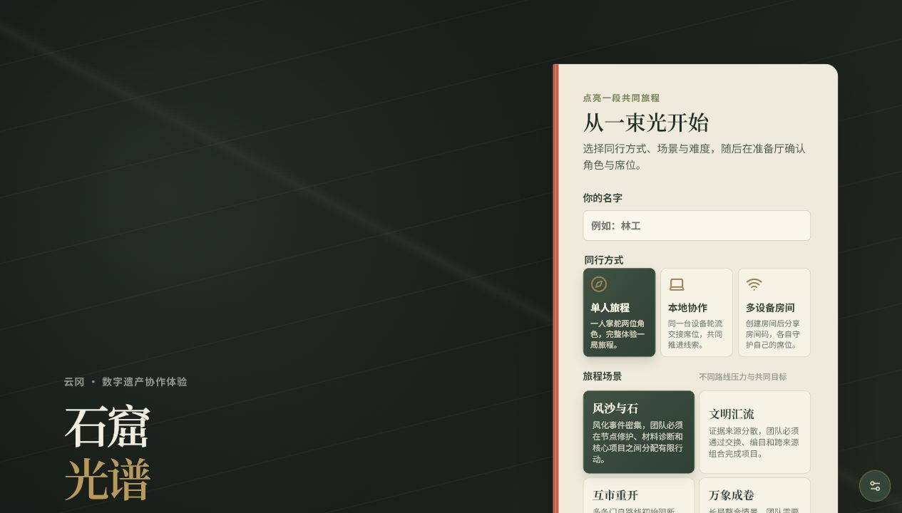
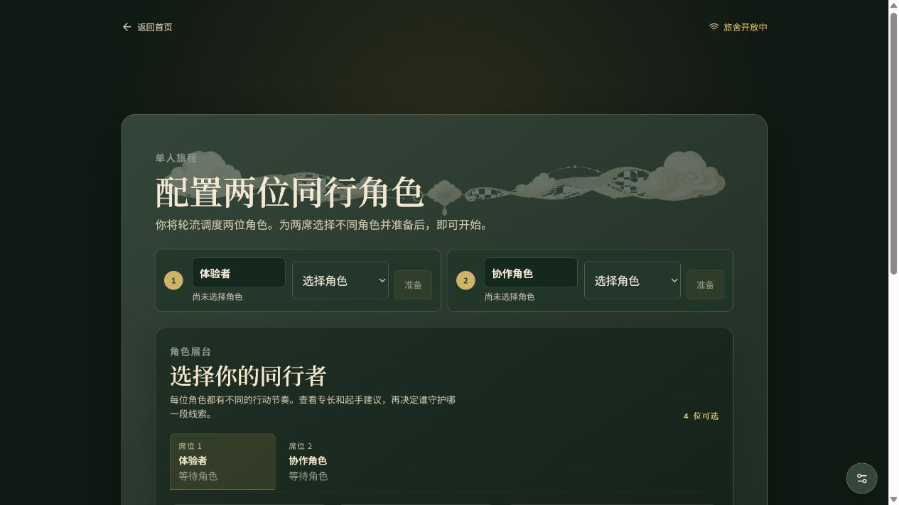
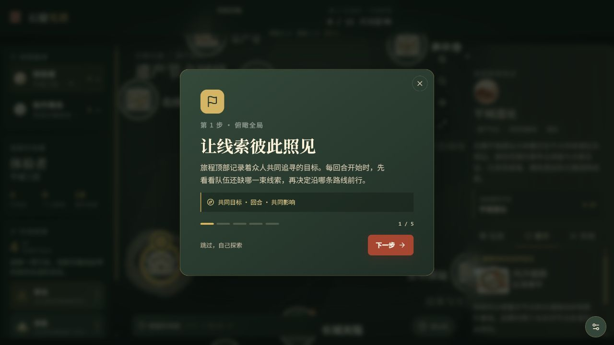
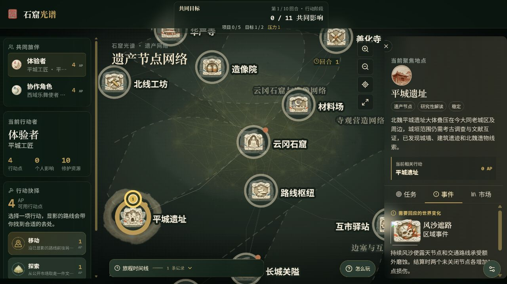
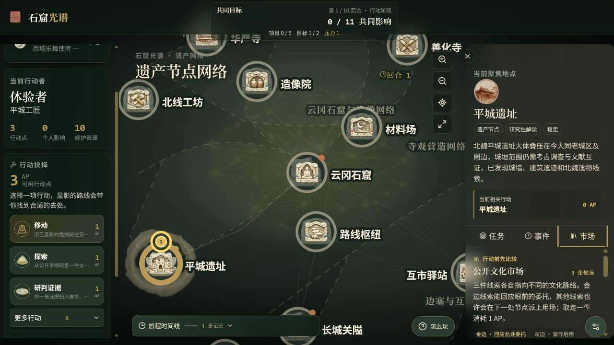
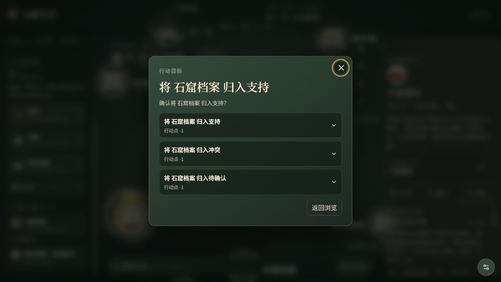

# 《石窟光谱》项目介绍、试玩操作与内容评审说明

> 这是一份给第一次接触项目的读者准备的说明。可以先看“跟着截图试玩”，再决定要从文化、叙事、哲学或游戏体验的哪个角度提出意见。文中涉及的历史信息、研究性说法和游戏设定并不处在同一个确定程度上，后文会专门说明这一点。

## 一、先用一句话理解项目

《石窟光谱》是一款以云冈石窟及大同文化遗产网络为主题的合作研判游戏。

玩家需要做的不是回答一道“唯一正确”的历史题，而是：

> 在材料不完整、不同地点和不同来源可能互相矛盾的情况下，和同伴一起形成一个暂时的解释，再决定应该立即保护、谨慎处理，还是先保留疑问。

所以游戏中的重要问题不是“哪张牌分数最高”，而是：

- 我们现在真正知道什么？
- 哪些材料可以互相支持，哪些材料正在提出反例？
- 现在采取行动，会不会因为过早下结论而失去别的可能？
- 如果继续观察，现场风险会不会先扩大？

试玩地址：<https://yungang.onrender.com>

## 二、跟着截图完成第一次试玩

第一次试玩建议选择“单人旅程—风沙与石—导览”难度。一个人也可以完整体验；如果多人一起玩，可以把角色分给不同的人讨论。

### 第 1 步：填写名字，选择同行方式和场景

打开网址后，在右侧的“从一束光开始”区域填写名字。

建议第一次这样选：

1. 同行方式选“单人旅程”。它不是简化版，而是由一个人轮流操作两位角色。
2. 场景选“风沙与石”。它的目标比较集中，适合先理解“移动—探索—研判—干预”的基本顺序。
3. 难度选“导览”。熟悉之后再换“标准”或其他场景。
4. 点击“进入准备厅”。

### 第 2 步：为两位同行者选择不同角色

准备厅会要求为两个席位各选择一位角色。角色不是装饰头像，而是不同的行动方式：

- **平城工匠**：更擅长处理节点损伤、完成修护。
- **西域乐舞使者**：更擅长连接不同来源的线索、帮助团队互相印证。
- **草原骑行使者**：更擅长移动、勘察路线和处理交通风险。
- **中原文书记官**：更擅长整理市场线索、保存和回收档案。

第一次可以选择“平城工匠 + 西域乐舞使者”。

选择角色后，要分别点击两个席位旁的“准备”，再点击“开始旅程”。如果“开始旅程”还是灰色，通常是某个席位还没有选角色或没有点击“准备”。

### 第 3 步：认识游戏地图上的四个区域

进入地图后，可以把画面理解成四部分：

1. **左侧：当前行动区**。这里显示现在轮到谁、还有多少行动点，以及可以做哪些事。
2. **中间：遗产网络地图**。圆形图标是地点，线条是路线；人物所在地点会有醒目标记。
3. **右侧：地点详情**。这里可以查看当前地点的说明、任务、事件和市场。
4. **底部：旅程时间线**。它记录刚才发生过的事情，也可以拖动标题栏把它移到合适的位置。

第一次进入时会自动出现一个 5 步新手教程。可以按“下一步”跟着看；如果想自己探索，也可以点击“跳过，自己探索”，之后随时点击右下角的“怎么玩”重新打开。

地图上的线不是单纯的装饰：路线可能畅通、承压或阻断。路线越危险，移动和项目推进就越需要提前安排。

### 第 4 步：移动到一个地点

点击左侧“移动”，地图上可以前往的路线会变得明显。再点击一个相邻地点，游戏会先告诉你：

- 这次移动要花多少行动点；
- 目的地是谁；
- 路线当前是否有风险；
- 确认之后会发生什么。

确认后人物才会移动。远处的地点可以查看简介，但通常要先抵达，才能在那里探索、修护或处理任务。

### 第 5 步：从公开市场寻找一张线索

抵达地点后，点击左侧“探索”，或者打开右侧“市场”页。市场每次会展示三张候选线索：

- 金色边框表示：这张线索比较可能回应当前地点的委托；
- 灰色边框表示：这张线索暂时不直接对应这里，但以后可能在别的地点有用；
- 取走一张线索会消耗 1 点行动点；
- 手牌不能无限增加，因此“现在拿什么、以后留什么”本身就是选择。

这里没有要求玩家背出唯一正确答案。更重要的是观察线索的描述，想一想它和当前地点、任务以及其他线索有什么关系。

### 第 6 步：把线索放到研究台

拿到线索后，点击左侧“研判证据”。游戏会让你把这张线索放入三个位置之一：

- **支持**：你认为它支持当前正在形成的解释。
- **冲突**：你认为它和当前解释不一致，或者提醒团队不要太快下结论。
- **待确认**：你觉得它有意义，但现有材料还不足以判断它到底说明什么。

这三个位置没有“看到红色就代表做错了”的意思。冲突和待确认都是有效的研究状态。它们的价值在于把团队的判断公开出来，方便同伴讨论“我们是不是忽略了另一种可能”。

### 第 7 步：形成解释，再选择一种干预

当一个地点的线索数量、领域和来源达到要求时，研究台会出现“形成当前解释”。点击后，团队需要在三种处理方式中选一种：

| 选择 | 你在表达什么 | 游戏上的结果倾向 |
| --- | --- | --- |
| **立即处理** | 现场风险不能再等，先采取行动 | 更快推进项目；如果解释里有冲突，可能增加压力 |
| **最小干预** | 只做当下必要、尽量可逆的处理 | 让风险和项目进度取得平衡 |
| **先记录** | 现在还不够确定，先保存材料、继续观察 | 获得更多研究线索，但可能错过及时修护的窗口 |

这一步是本游戏最重要的价值判断：不同选择都可能有道理，但它们对现场、团队和后续研究的影响不同。

### 第 8 步：结束回合，观察后果

当两位同行者都完成行动后，结束回合。系统会先展示下一轮可能发生的事件，再结算风沙、雨季、路线压力或其他变化。

请留意三件事：

1. 哪些地点的损伤增加了；
2. 哪些路线变得更危险或被阻断；
3. 你们刚才形成的解释和干预，是否改变了项目进度、资源或共同目标。

一局通常需要 20–35 分钟。胜利不是个人得分最高，而是团队在压力到达上限前完成核心项目并守住共同目标。

## 三、地图和界面上的词是什么意思

| 词语 | 通俗理解 |
| --- | --- |
| 行动点 | 每位角色每回合可以做几件事的额度，界面写作 AP；移动、探索、研判通常各消耗 1 点 |
| 修护资源 | 全队共享的保护材料和人力；用完后不能随意修护所有地点 |
| 共同影响 | 团队对遗产网络产生的总体推进；不是某一位角色的个人排名 |
| 风化压力 | 整张网络面对的总体危险；过高会导致失败 |
| 地点损伤 | 某个节点当前受到的具体损害；损伤过高可能导致地点关闭 |
| 线索/证据 | 带有地点、领域、来源和描述的文化卡片；它们是研究材料，不是选择题答案 |
| 地点任务 | 在一个具体地点要回答的研究问题 |
| 多阶段项目 | 需要跨地点、跨角色合作完成的较大目标，通常经历“探索—比较—落地” |
| 世界事件 | 回合结束时影响地点、路线、资源或压力的变化 |
| 路线治理 | 勘察、修护和连接路线，让遗产网络保持可通行、可交流 |

## 四、项目中有哪些内容

当前版本包含：

| 内容 | 数量 | 在游戏中的作用 |
| --- | ---: | --- |
| 场景 | 6 | 每个场景有不同的压力、路线、项目和事件组合 |
| 地点 | 24 | 地图上的遗产地点、研究入口和修护对象 |
| 路线 | 42 | 连接地点，也会被阻断、承压、修护和重新连接 |
| 区域 | 4 | 平城都城、云冈造像、寺观营造、边塞互市四个叙事视角；不是历史边界复原 |
| 文化线索 | 48 | 涉及造像、纹样、建筑、边塞、交通与互市等领域 |
| 世界事件 | 24 | 风沙、雨季、路线负担、记录缺口、联合保护等变化 |
| 角色 | 4 | 四种不同的团队分工 |
| 角色升级 | 8 | 让角色在中后期形成更鲜明的行动方式 |
| 策略牌 | 16 | 路线治理、事件预案、交换和资源调度 |
| 多阶段项目 | 12 | 把一连串研究与保护行动串成较大的共同目标 |
| 地点任务 | 24 | 让每个地点有需要讨论的具体问题 |
| 共同目标 | 5 | 保护地点、恢复路线、形成多来源解释、完成项目和连接区域 |

### 六个场景分别在练习什么

| 场景 | 体验重点 |
| --- | --- |
| 风沙与石 | 在风化压力下决定先修护哪里、哪些线索值得保留 |
| 文明汇流 | 通过交换和不同来源的材料，完成跨文化的比较 |
| 互市重开 | 勘察、修护并重新建立一条能够维持交流的路线 |
| 万象成卷 | 同时处理多个区域、多个项目和连续事件，适合熟悉后挑战 |
| 雨季守护 | 在连续环境压力中练习优先级判断 |
| 数字档案开卷 | 通过测绘、图像整理和档案互证理解数字保存 |

## 五、文化内容应该怎样理解

项目有意把“历史事实”“研究假设”和“游戏情境”分开。

### 1. 可以当作地点基本介绍的信息

云冈石窟、华严寺、善化寺等地点的基本介绍，目标是提供一个可靠、克制的进入点。欢迎评审者指出年代、建筑名称、地点关系和表述是否准确。

### 2. 需要保留疑问的研究性内容

例如平城遗址与周边地点之间的关系，有些内容需要考古、文献和不同学科共同讨论。游戏希望玩家感受到“提出解释”和“验证解释”的过程，而不是把尚未确定的关系包装成结论。

### 3. 为了让研究过程能够被玩出来而设置的内容

许多线索卡、事件卡和任务，是把观察、比较、记录、修护、协作等过程转成游戏动作。它们可以帮助玩家理解研究工作的结构，但不应被当作文献本身。

特别是卡牌上的“来源”“传播”“互鉴”等词，主要是帮助玩家比较材料的提示。它们不能替代学术来源，也不自动证明某个历史判断。

## 六、最希望得到的内容与思想层面反馈

### A. 事实、语境和表达

- 地点、建筑、材料、图像、路线和保护术语是否准确？
- 哪些地方把推测说得太满，应该改成“可能”“有待确认”或“游戏中的解释”？
- 哪些卡牌名称看起来太像真实文物或史料，容易让人误以为已有明确出处？
- “文化交流”“互鉴”“传播”等概念是否有具体材料支撑，还是过于宽泛？

### B. 证据和解释的哲学意味

- “支持 / 冲突 / 待确认”是否让你想到真实研究中的证据等级、解释竞争或知识的不确定性？
- 冲突证据是否被当作麻烦，还是被理解成值得保留的反例？
- 游戏是否鼓励玩家承认“不知道”，而不是强行拼出一个漂亮结论？
- “形成解释”之后再选择行动，是否体现了知识判断与现实行动之间的张力？

### C. 保护伦理与价值取舍

- “立即处理、最小干预、先记录”是否代表了不同的保护伦理，而不只是三个数值按钮？
- 先记录会错过修护窗口，这种取舍是否合理、是否需要更清楚的后果说明？
- 游戏有没有把“保护遗产”简化成降低损伤、增加分数？还可以加入哪些人的经验、记忆或地方视角？
- 不同角色的分工是在帮助讨论，还是让某个人变成唯一的正确决策者？

### D. 叙事和文化体验

- 地图上的地点是否像一个互相联系的文化网络，而不是普通游戏关卡？
- 哪一张卡、哪一个地点或哪一次事件让你感到“这确实与云冈及大同有关”？
- 哪些内容只是把普通资源牌换成文化名词？
- 场景名称和事件文案是否形成了清楚的叙事气质？

### E. 试玩节奏和理解难度

- 第一次试玩时，你是否知道下一步该做什么？哪个词最难懂？
- 20–35 分钟中，哪一段最有讨论价值，哪一段最像重复点击？
- 一个人轮流操作两个角色是否容易理解？多人一起玩时，是否真的需要互相讨论？
- 地图、右侧地点详情、市场和研究台的信息量是否合适？

## 七、建议的试玩记录方式

试玩时不必写长篇报告，记录下面五项就很有帮助：

| 记录项 | 可以怎么写 |
| --- | --- |
| 一个有文化意义的瞬间 | “看到某张线索后，我开始想到……” |
| 一个像普通游戏的瞬间 | “这个动作只是花 1 点行动点换一个数字……” |
| 一个可能误读的句子 | 抄下原文，写出你第一次的理解 |
| 一个有争议的选择 | 你选了什么，为什么，是否后悔 |
| 一个最值得修改的地方 | 改文案、改规则、加内容或删内容，并说明原因 |

如果希望方便整理，可以在反馈前加上这些标签：

- **[事实]**：年代、地点、术语、文物或来源问题；
- **[误读]**：玩家可能把游戏设定当成历史结论；
- **[解释]**：证据关系、冲突、待确认或形成解释的问题；
- **[伦理]**：保护、干预、记录和行动后果的问题；
- **[叙事]**：人物、地点、事件或整体文化气质的问题；
- **[节奏]**：过慢、重复、信息过多或讨论不足；
- **[界面]**：按钮、提示、布局或操作不清楚；
- **[扩展]**：希望增加的新地点、线索、事件或观点。

一次具体反馈最好包含：**看到的位置或原文 → 你的理解 → 为什么有问题 → 建议方向**。

## 八、试玩前的最后提醒

- 不需要安装软件，浏览器打开 <https://yungang.onrender.com> 即可。
- 第一次不必试图看懂所有牌；完成一次“探索—研判—形成解释—选择干预”就已经足够理解核心玩法。
- 游戏里的线索组合是玩家在这一局中提出的解释，不是历史事实证明。
- 视觉素材主要用于帮助辨认地点、角色和卡牌，不代表文物复原图或最终展览视觉。
- 如果页面第一次打开较慢，等待片刻后刷新即可。
